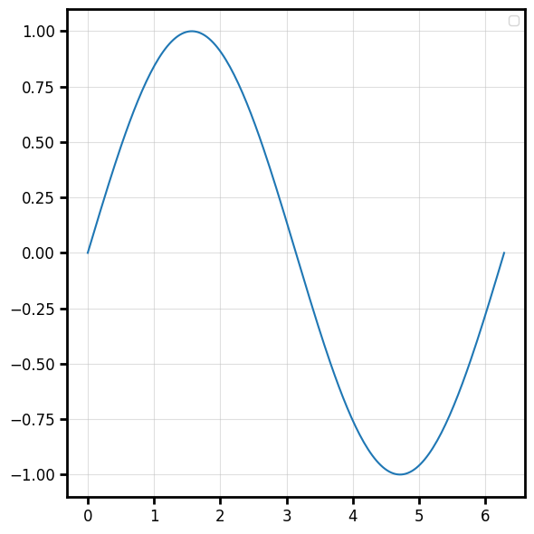
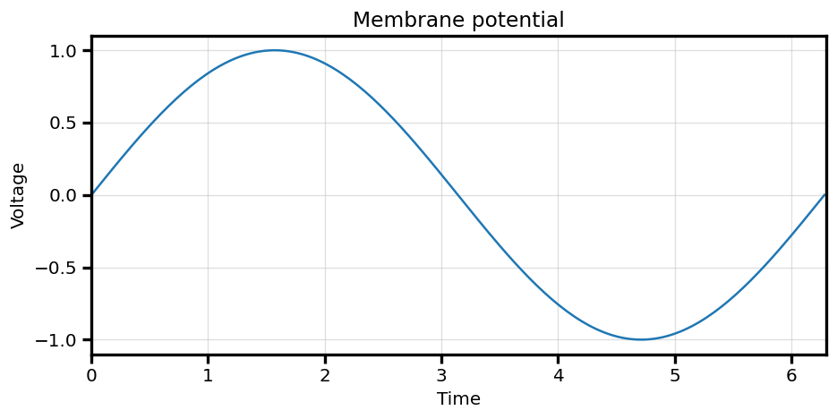
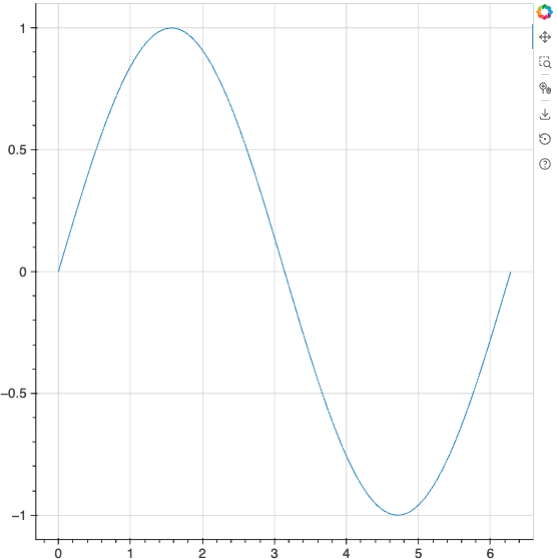

# behaviz

A modular, multi-backend plotting library that gets you from **raw data to a clean, clear and reproducible figures - fast**.


[](https://www.gnu.org/licenses/gpl-3.0)
[](https://github.com/kaancet/behaviz/actions/workflows/tests.yml)
[](https://behaviz.readthedocs.io/en/latest/)


## Why behaviz?

Scientific plotting libraries are powerful but can be verbose: you spend more time wrangling
keyword arguments, call signatures, and styling than looking at your data. behaviz is
built for researchers who want **publication-quality plots without becoming matplotlib
experts**.

It aims to solve two problems:

1. **Consistent, reproducible plots for similar data:**  describe a plot once with a
   `spec`, reuse it everywhere.
2. **High-level calls with low-level control:** simple functions like `plot_line` and
   `plot_scatter` that still let you reach any underlying plot property through keyword
   overrides.

The same code can render through **matplotlib**, **seaborn**, or **bokeh**, and you can switch
backends with a single line.

### Highlights

- **One simple call per plot:** `plot_line`, `plot_scatter`, `plot_bar`, `plot_step`, `plot_errorbar`, `plot_violin`, `plot_image`,`plot_fill_between`, `plot_pie`, `plot_hexbin`
- **Three interchangeable backends:** `set_renderer("matplotlib" | "seaborn" | "bokeh")`
- **Painless colorbars:** `plot_image(data, colorbar="label")` — auto-sized, no mappable juggling
- **Plot from anything:** NumPy arrays, **pandas** / **polars** DataFrames, or plain dicts
- **Opt-in hover-tooltips:** (`hover_annotate=True`)
- **Cross-backend styling:** canonical keywords (`color`, `linewidth`, `alpha`, …) that work on every backend
- **Reusable specs & presets:** chainable `.with_*()` helpers, plus `save_preset` / `load_preset` to a personal `~/.behaviz` library
- **Visual data manipulators:** jitter, smoothing, normalising, binning that add visual manipulations without changing the original data

### [Documentation](https://behaviz.readthedocs.io/en/latest/)


## Installation

[uv](https://github.com/astral-sh/uv) is recommended forfor dependency management.

```bash
uv pip install behaviz
```

Or add it directly through git:

```bash
uv add git+https://github.com/kaancet/behaviz.git
# or with pip
pip install git+https://github.com/kaancet/behaviz.git
```

Once installed, initialize the `~/.behaviz` preset directory (not necessary but it's convenient for discoverability and manually dropping/editting preset files)

```bash
behaviz init
```

<br>


## Quickstart

```python
import numpy as np
import behaviz as bv

x = np.linspace(0, 2 * np.pi, 100)
y = np.sin(x)

# matplotlib is the default backend, nothing else to set up
fig, ax = bv.plot_line(x, y, color="#349888", linewidth=2, label="sin(x)")
```



Every plot function returns a `(fig, ax)` tuple, so you can keep customizing with the
native backend objects if you ever need to.

<br>

## Core concepts

### The return contract

| Function | Returns |
|---|---|
| `plot_line`, `plot_scatter`, `plot_bar`, `plot_step`, `plot_errorbar`, `plot_image`,`plot_fill_between`, `plot_pie`, `plot_hexbin` | `(fig, ax)` |
| `plot_violin` | `(fig, ax, vp)`-`vp["bodies"]` holds the violin artists |

When you pass an existing `ax=`, the plot is drawn onto it and the **same** axes is
returned, so you can layer plots:

```python
fig, ax = bv.plot_line(x, np.sin(x), label="sin")
bv.plot_line(x, np.cos(x), ax=ax, label="cos", color="orange")   # same axes
```



### Switching backends

```python
bv.set_renderer("matplotlib")   # default
bv.set_renderer("seaborn")      # matplotlib + seaborn themes
bv.set_renderer("bokeh")        # interactive HTML (great for dashboards)
```

The **same plotting code** works on all three. Only the display step differs for bokeh,
which renders to HTML and needs an explicit `show()`:

```python
import behaviz as bv
from bokeh.plotting import show
from bokeh.io import output_notebook

bv.set_renderer("bokeh")
fig, ax = bv.plot_line(x, y)

output_notebook()   # in a Jupyter notebook
show(ax)            # for bokeh, `ax` *is* the figure
```




## How it works (architecture)

behaviz is intentionally layered so each piece stays small and testable:

- **`spec/`:** plain dataclasses (`PlotSpec`, `AxisSpec`, `FigureSpec`) describing *what*
  a plot should look like, independent of any backend.
- **`core/`:** the public plot functions. The simple `(x, y)` ones (`plot_line`,
  `plot_scatter`, `plot_step`) are generated from a single template in `core_factory.py`;
  richer ones are hand-written. A decorator (`plot_function`) handles figure creation,
  `data=` resolution, and spec application uniformly.
- **`backends/`:** one `Renderer` per backend translating canonical calls into native
  matplotlib / seaborn / bokeh, plus an `Overrider` that routes keyword arguments and an
  opt-in `HoverEngine`.
- **A registry:** validates at import that every plot type is fully implemented across all
  backends so that the gaps fail loudly during development, not at call time.

This is what lets the *same* call render on three backends and lets you reach any
low-level property through a single high-level function.
