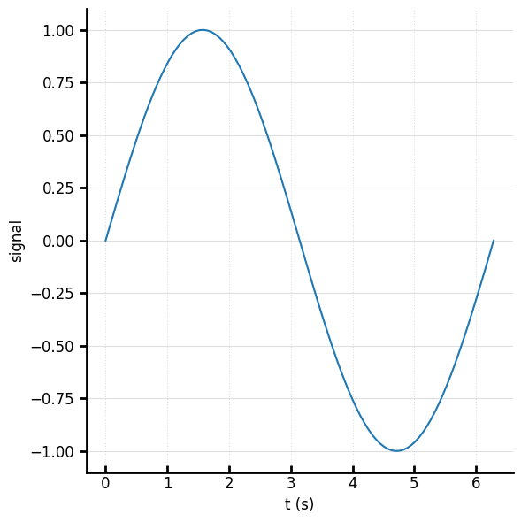

# Core concepts

## The return contract

Every `plot_*` function returns `(fig, ax)`. `ax` is the drawable surface for the active
backend (a matplotlib `Axes`, or — for bokeh — the `figure` itself, since bokeh has no
separate axes object).

## Canonical calls → native backends

You call one high-level function. A `Renderer` per backend translates it into native
matplotlib / seaborn / bokeh calls. An `Overrider` routes your keyword arguments to the
right native property. This is what lets the same call render three ways.

### Switching backends

The **same plotting code** works on all three. Only the display step differs for bokeh, which renders to HTML and needs an explicit `show()`

```python
import numpy as np
import behaviz as bv
from bokeh.io import show, output_notebook

x = np.linspace(0, 2 * np.pi, 100)
y = np.sin(x)  

```

=== "matplotlib"

    ```python
    bv.set_renderer("matplotlib")

    fig, ax = bv.plot_line(x, y)
    ```

    

=== "bokeh"

    ```python
    bv.set_renderer("bokeh")

    fig, ax = bv.plot_line(x,y)
    show(fig) # or ax, bokeh only has a Figure object
    ```

    <iframe src="../res/embeds/quick_bokeh.html" width="100%" height="420" style="border:none"></iframe>
