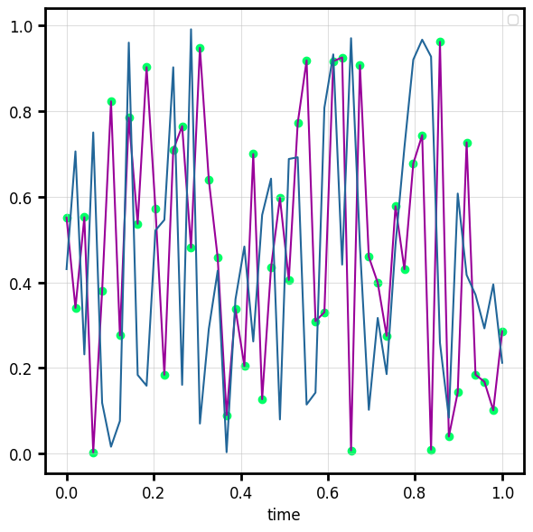

# Data input

behaviz accepts numpy arrays directly, or **column names** resolved against a `data=`
source (a pandas/polars DataFrame or a dict).

## Resolution rules

```python
import numpy as np
import polars as pl   # or pandas, both work identically
import behaviz as bv

df = pl.DataFrame({"time": np.linspace(0, 1, 50),
                   "voltage": np.random.rand(50)})

# keyword column names
fig, ax = bv.plot_line(x="time", y="voltage", data=df, color="#990099")

# positional column names work too
fig, ax = bv.plot_scatter("time", "voltage", data=df, ax=ax, color="#00FF66")

# mix and match: a column name for x, a raw array for y
fig, ax = bv.plot_line(x="time", y=np.random.rand(50), data=df, ax=ax, color="#226699")
```



The rule is the same one seaborn uses: **when `data` is given, a string means "column
name"; otherwise everything is treated as raw data.** Arrays without `data=` behave
exactly as before.

When a channel comes from a named column and you haven't set a label, behaviz uses the
column name automatically

> Supported data sources: anything that responds to `data["column"]` and yields an
> array: pandas DataFrame, polars DataFrame, or `dict[str, array]`. (Pass an *eager*
> polars frame; call `.collect()` on a `LazyFrame` first.)

## Validation & errors

Every plot function declares a *contract* for its data arguments through [channels](channel.md), and behaviz
validates your input according it before plotting — so you can pass whatever you have:

- lists, tuples, NumPy arrays, pandas/polars Series, ranges, generators -> all become arrays
- scalars are promoted where they make sense (`plot_vertical(1.5)`, `plot_bar(..., width=0.2)`)
- trivial 2-D shapes `(N, 1)` / `(1, N)` are squeezed to 1-D
- grouped inputs (`plot_violin`'s `ys`) accept a list of arrays (can be ragged lengths)

When the input genuinely doesn't fit, behaviz raises a `BehavizDataError`
(a `ValueError` subclass) that names the offending argument, shows what it got, and
suggests a fix:

```python
rng = np.random.default_rng(0)
positions = np.arange(0,5)
distributions = [rng.normal(loc=p, scale=0.5, size=200) for p in np.arange(0,6)]

fig, ax, vp = bv.plot_violin(positions, distributions)

#error message:
BehavizDataError: plot_violin: `ys` must have the same length as `x`.
  x : ndarray shape (5,)
  ys: list of 6 arrays (lengths 200, 200, 200, 200, 200, 200)
Hint: got 5 vs 6 — pass one `ys` entry per `x` entry.
```

## See also

- [Grouping](grouping.md) — split by `hue=` / `group=`.
