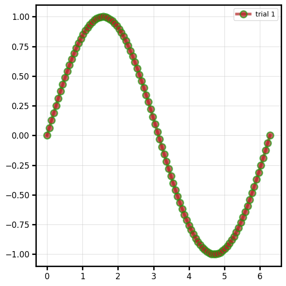
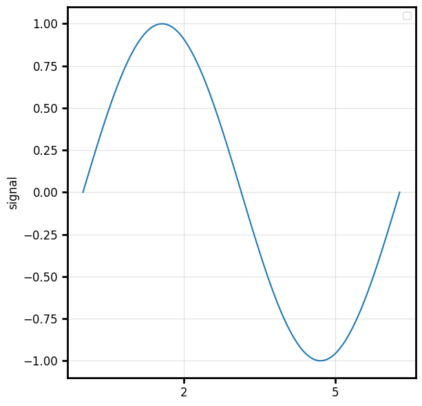

# Overriding

Beyond the spec, any extra keyword to a plot function is an **override** routed to the
active backend.

## Keyword passthrough

```python
import numpy as np
import behaviz as bv

x = np.linspace(0, 2 * np.pi, 100)
y = np.sin(x)

bv.plot_line(x, y, 
             color="firebrick", 
             linewidth=4, 
             alpha=0.7, 
             marker="o",
             markersize=10,
             markeredgecolor="#229911",
             markeredgewidth=2,
             label="trial 1")
```



behaviz maps canonical names to native ones per backend (`color` → mpl `color` /
bokeh `line_color`+`fill_color`; `label` → `legend_label`). Backend-specific kwargs you pass
that aren't canonical are forwarded as-is.

## Reaching raw backend properties

You can also grab the returned `(fig, ax)` and set native properties directly, or use the
[canvas](saving.md) context manager.

=== "matplotlib"

    ```python
    f,ax = bv.plot_line(x, y)

    ax.set_xticks([2,5])
    ax.set_ylabel("signal")
    ```

    

=== "bokeh"

    ```python
    f,ax = bv.plot_line(x, y)

    ax.xaxis.ticker = [2,5]
    ax.yaxis.axis_label = "signal"
    show(ax)
    ```

    <iframe src="../res/embeds/backend_bokeh.html" width="100%" height="420" style="border:none"></iframe>
    