# Basic plots

The everyday XY plots. All accept ```x``` and ```y```arrays or `data=` and  ```x``` and ```y``` as string column names, an optional `spec=`, ```ax=``` and backend agnostic [overrides](../overriding.md). All support
[`hue=` / `group=`](../grouping.md).

```python
import numpy as np
import behaviz as bv
import polars as pl

bv.set_renderer("matplotlib") # can also be "seaborn" or "bokeh"

x = np.linspace(0, 2 * np.pi, 100)
y = np.sin(x)

df = pl.DataFrame({"t":x,
                   "signal":y
                   })
```

## Line — `plot_line`

```python
bv.plot_line(x, y)
```

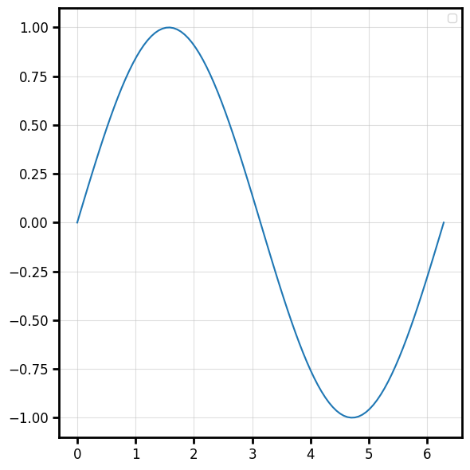

When plotting from a DataFrame, the column names are automatically set as axis labels

```python
bv.plot_line("t", "signal", data=df, color="firebrick", linewidth=2, label="Signal")
```

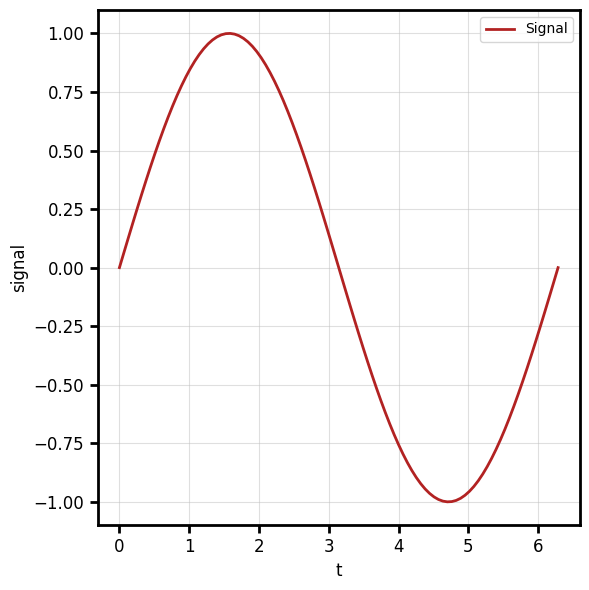

**Channels:** `x` (vector), `y` (vector, same length as `x`).

## Scatter — `plot_scatter`

```python
bv.plot_scatter(x, y, color="k", alpha=0.5)
```

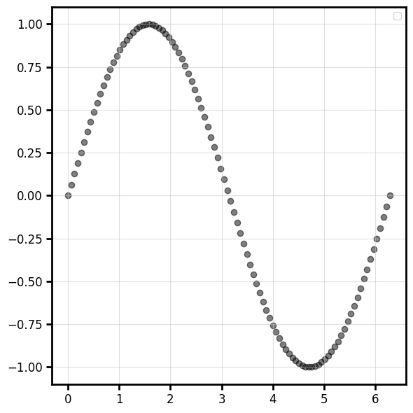

## Step — `plot_step`

Staircase line. `where` controls where the step happens (`"pre"`, `"post"`, `"mid"`).

```python
bv.plot_step(x, y, where="post")
```

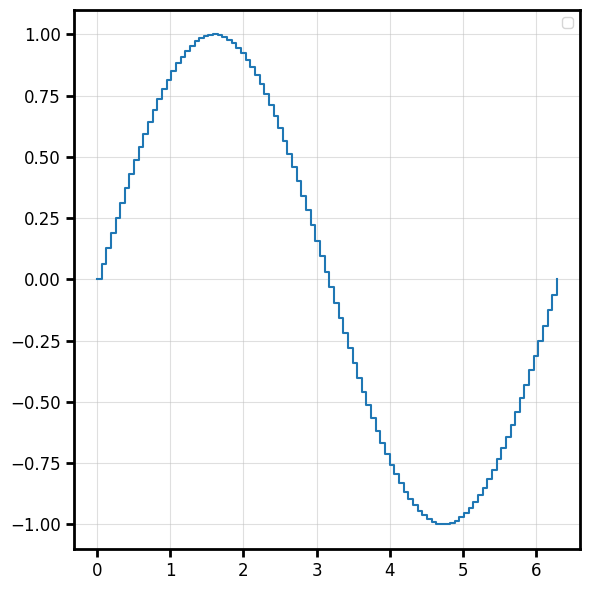

## Bar — `plot_bar`

```python
bv.plot_bar(x, y, width=0.1,color="#249922",edgecolor="#880000",linewidth=1)
```

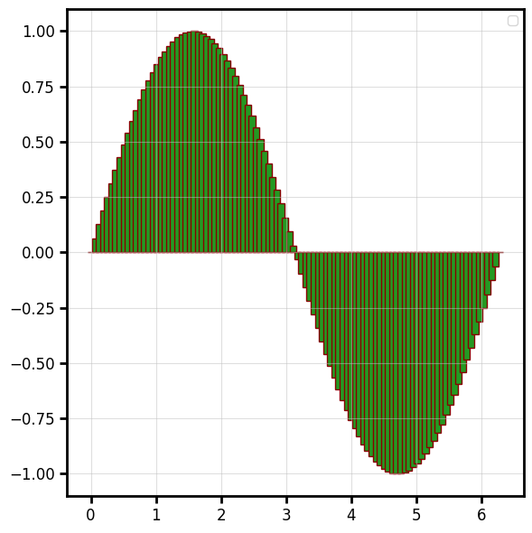

## Horizontal bar — `plot_hbar`

```python
bv.plot_hbar(y, x, ax=ax,height=0.1,color="#249922",edgecolor="#880000",linewidth=1)
```

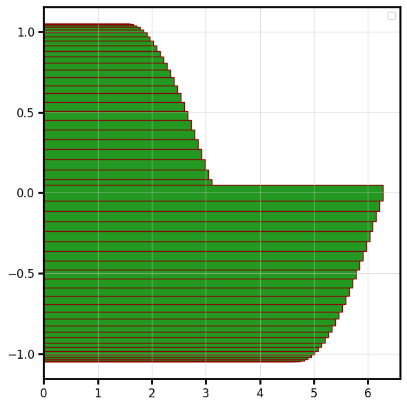

## Error bars — `plot_errorbar`

```python
lower = np.full_like(y, 0.15)
upper = np.full_like(y, 0.33)
err = np.vstack([lower, upper])

bv.plot_errorbar(x[::2], y[::2], err[:,::2],color="navy", capsize=3, elinewidth=2, linewidth=0)
```

Override the cap/line styling with `capsize=`, `elinewidth=`, `ecolor=`, `capthick=`

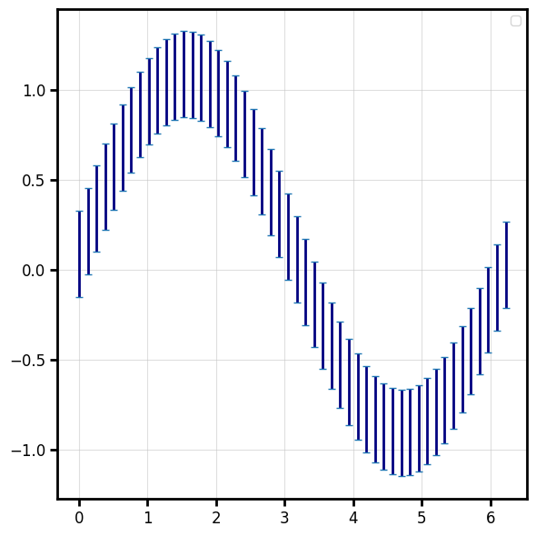

## Fill between — `plot_fill_between`

A shaded band between two curves (or a curve and a constant).

```python
f,ax = bv.plot_line(x,y)
bv.plot_fill_between(x, y-lower, y+upper, ax=ax,alpha=0.3) 
```

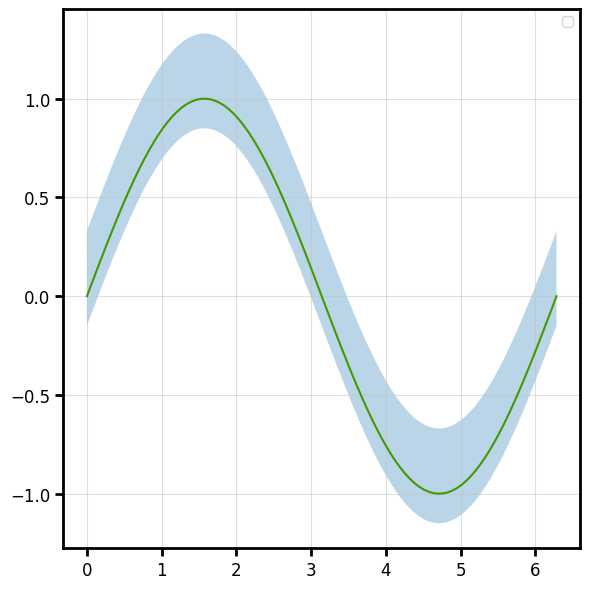

## Violin - ```plot_violin```

```python
rng = np.random.default_rng(0)
positions = np.array([1.0, 2.0, 3.0])
distributions = [rng.normal(loc=p, scale=0.5, size=200) for p in positions]

fig, ax, vp = bv.plot_violin(positions, distributions)
```

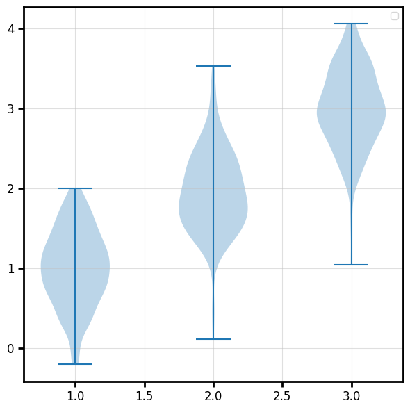

## Image

Display a 2-D array as a colour-mapped image (heatmap):

```python
data = np.random.default_rng(0).normal(size=(40, 60))
fig, ax = bv.plot_image(data, origin="lower", cmap="magma")
```

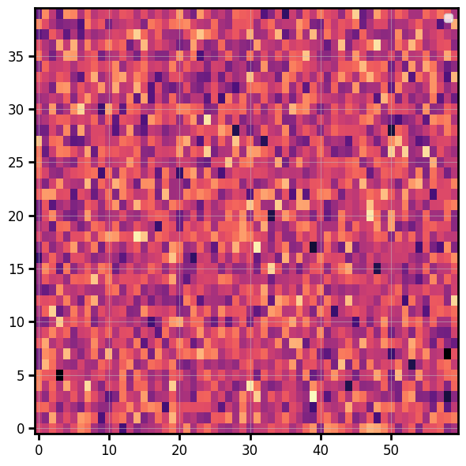

### Colorbar

A matplotlib colorbar normally means capturing the mappable and wrestling with sizing.
Here it's one opt-in keyword, and the bar is auto-sized to match the image height:

```python
bv.plot_image(data,cmap="turbo",colorbar="Firing rate (Hz)")   # a string is the label
```

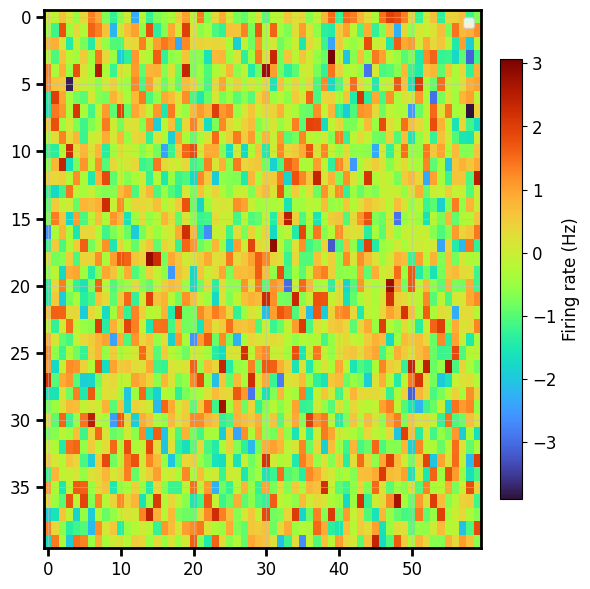

For full control, pass a `ColorbarSpec` — the same call works on every backend:

```python
from behaviz import ColorbarSpec

cbar_spec = ColorbarSpec(label="Hz", 
                         location="bottom", 
                         ticks=[-2, 0, 2], 
                         tick_fmt="%.0f")

bv.plot_image(
    data, cmap="viridis",
    colorbar=cbar_spec,
)
```

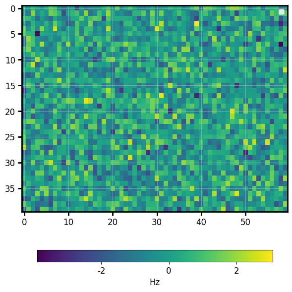

> `plot_image` currently handles 2-D scalar arrays; RGB(A) images are on the roadmap.

## Pie

```python
fig, ax = bv.plot_pie([30, 25, 15, 30], labels=["A", "B", "C", "D"], autopct="%.0f%%")
```

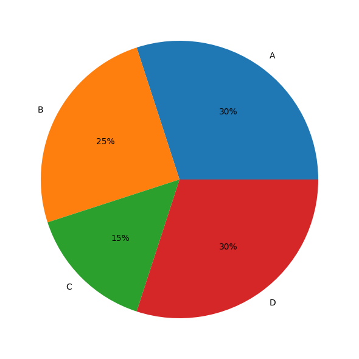

(`autopct` is matplotlib/seaborn only; on bokeh the slice labels are drawn inside the wedges.)

## Hexbin

A 2-D histogram of raw point data, binned into hexagons and coloured by count — with the same
opt-in `colorbar`:

```python
rng = np.random.default_rng(0)
px, py = rng.normal(size=4000), rng.normal(size=4000)
fig, ax = bv.plot_hexbin(px, py, gridsize=25, cmap="viridis", colorbar="count")
```

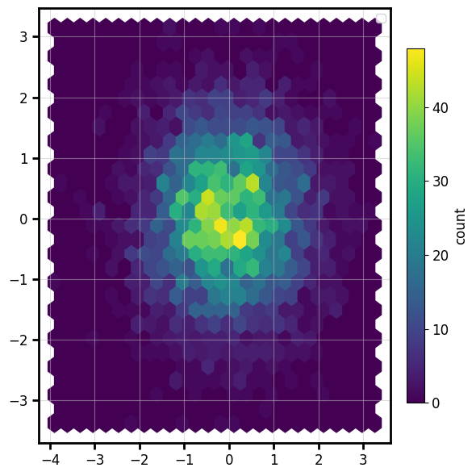
