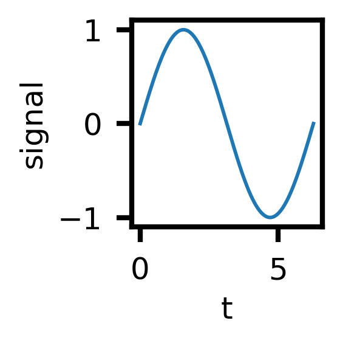
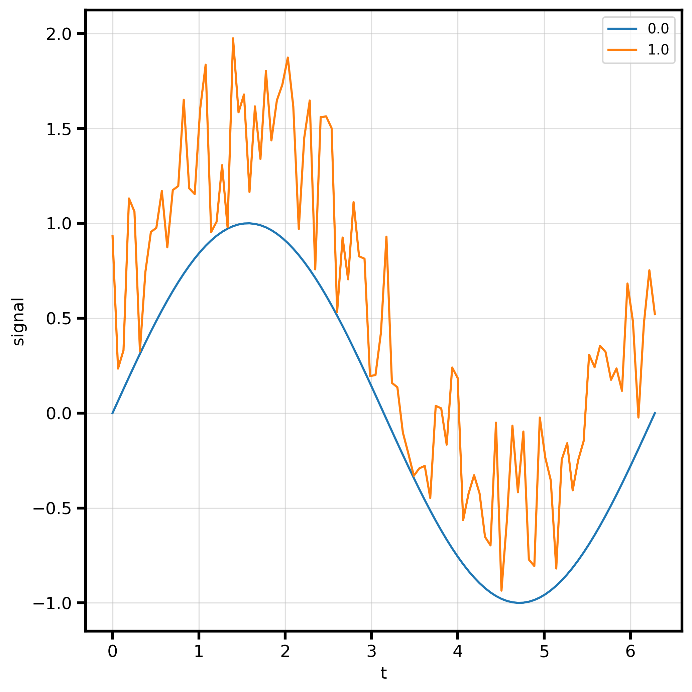

# Quickstart

Five minutes from import to a saved, styled, multi-backend plot.

## 1. Your first plot

Every plot function returns a `(fig, ax)` tuple. matplotlib is the default backend, so
there is nothing to configure.

```python
import numpy as np
import behaviz as bv

x = np.linspace(0, 2 * np.pi, 200)
y = np.sin(x)

fig, ax = bv.plot_line(x, y)
```


## 2. Switch the backend

The *same call* renders on a different engine. Set it once, globally.

```python
bv.set_renderer("bokeh")        # or "seaborn", "matplotlib"
fig, ax = bv.plot_line(x, y)    # now an interactive bokeh figure
```
<!-- embed a standalone bokeh HTML (carries its own BokehJS via CDN) -->
<iframe src="../res/embeds/quick_bokeh.html" width="100%" height="420" style="border:none"></iframe>

## 3. Plot from a DataFrame

Pass `data=` and reference columns by name (positional or keyword). See
[Data input](data.md) for the full resolution rules.

```python
import polars as pl

x = np.linspace(0, 2 * np.pi, 100)
y = np.sin(x)
df = pl.DataFrame({"t": x, "signal": y})

bv.plot_line("t", "signal", data=df)
```


## 4. Style it with a spec

A [`PlotSpec`](specs/index.md) describes the look. Chainable `with_*` mutators keep it
terse.

```python
spec = (
    bv.PlotSpec()
    .with_title("Membrane potential")
    .with_xlabel("Time", )
    .with_ylabel("Voltage")
    .with_xlim(0, 6.3)
)

bv.plot_line("t", "signal", data=df, spec=spec)
```


Or start from a [preset](presets.md):

```python
spec = bv.load_preset("paper")
bv.plot_line("t", "signal", data=df, spec=spec)
```



## 5. One line per category

`hue=` colors and adds a legend; `group=` draws one series per category with no legend.
See [Grouping](grouping.md).

```python
x = np.linspace(0, 2 * np.pi, 100)
y = np.sin(x)
cond1 = np.zeros_like(y)

y2 = y + np.random.rand(100)
cond2 = np.ones_like(y2)


df = pl.DataFrame({"t":np.hstack((x,x)),
                   "signal":np.hstack((y,y2)),
                   "condition":np.hstack((cond1,cond2)),
                   })


df
bv.plot_line("t", "signal", data=df, hue="condition")
```



## 6. Save it

`bv.save()` dispatches on the active backend and the file extension.

```python
fig, ax = bv.plot_line("t", "signal", data=df)
bv.save(fig, "figure.png")        # mpl/seaborn: png/svg/pdf...; bokeh: html/png/svg
```

Or use the canvas context manager to group several draws onto one axes and save in one
shot:

```python
with bv.canvas(spec=spec, save="figure.png") as ax:
    bv.plot_line("t", "signal", data=df)
    bv.plot_scatter("t", "signal", data=df)
```

## Next

- [Core concepts](concepts.md) — the model behind the calls.
- [Plotting overview](plots/index.md) — every plot type.
- [The spec system](specs/index.md) — full styling vocabulary.
