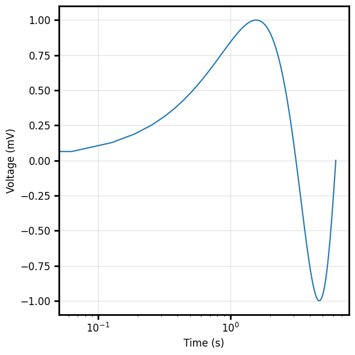
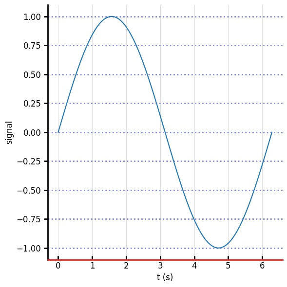
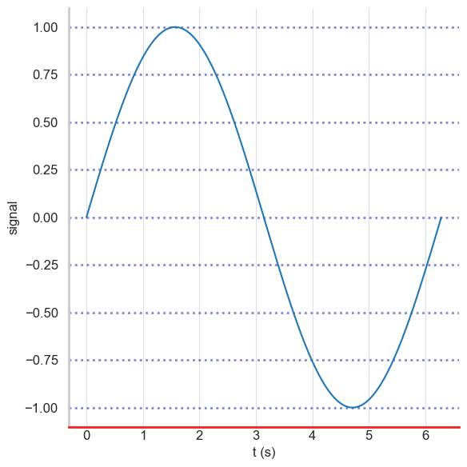

# AxisSpec

`spec.x` and `spec.y` are each an `AxisSpec` — **independent**, so the two axes can
differ in scale, ticks, grid, spines, everything below.

```python
import behaviz as bv
import numpy as np
import polars as pl

x = np.linspace(0, 2 * np.pi, 100)
y = np.sin(x)

spec = bv.PlotSpec(
    x=bv.AxisSpec(label="Time", unit="s", scale=bv.ScaleType.LOG),
    y=bv.AxisSpec(label="Voltage", unit="mV", scale=bv.ScaleType.LINEAR),
)

bv.plot_line("t", "v", data=df, spec=spec)
```



!!! note "Cross-backend"
    Every field below takes effect on matplotlib, seaborn **and** bokeh, except the two
    marked *matplotlib only* (`spine_offset`, `spine_trim`) — bokeh has no spine model —
    and `tick_sides`, which on bokeh can only toggle the primary side (bottom/left).

## Fields

| Field | Default | Meaning |
| --- | --- | --- |
| `label` | `""` | axis label |
| `unit` | `""` | appended automatically → `"Voltage (mV)"` |
| `fontsize` | `12` | label + tick-label font size |
| `scale` | `"linear"` | `linear` / `log` / `symlog` / `logit` |
| `lim` | `None` | `(min, max)` or `None` → auto |
| `ticks` | `None` | explicit tick positions (numbers, or strings → categorical labels) |
| `tick_fmt` | `None` | printf format, e.g. `"%.2f"` |
| `invert` | `False` | flip axis direction |
| `spines` | all four | which spines to draw |
| `spine_width` | `2` | spine line width |
| `spine_color` | `None` | spine colour (`None` → backend default) |
| `spine_offset` | `0` | push spine outward, px — *matplotlib only* |
| `spine_trim` | `False` | clip spine to the outer ticks — *matplotlib only* |
| `tick_dir` | `"out"` | tick direction: `out` / `in` / `inout` |
| `tick_length` | `None` | tick length (`None` → `3 × spine_width`) |
| `tick_width` | `None` | tick line width (`None` → `spine_width`) |
| `tick_color` | `None` | tick colour |
| `tick_sides` | `None` | sides that show tick marks (`["bottom"]`, `["left","right"]`, …) |
| `grid` | `True` | major grid on |
| `grid_minor` | `False` | minor grid on |
| `grid_color` | `"#c1c1c1"` | grid colour |
| `grid_alpha` | `0.5` | grid opacity |
| `grid_style` | `"-"` | major grid linestyle (`-`, `--`, `:`, `-.`) |
| `grid_width` | `0.8` | major grid line width |

## Examples

### Labels, units, scales, limits font size... everything!

```python
spec = bv.PlotSpec(
    x=bv.AxisSpec(label="t", fontsize=16, lim=(0, 10)),
    y=bv.AxisSpec(unit="Hz", fontsize=16, lim=(1e-3, 1e2), scale=bv.ScaleType.LOG, grid_minor=True),
)

bv.plot_line("t", "v",data=df, spec=spec)
```


### Ticks: direction, length, width, colour

```python
spec = bv.PlotSpec(
    x=bv.AxisSpec(label="t",fontsize=16,lim=(0, 10)),
    y=bv.AxisSpec(tick_dir="in", tick_length=8, tick_width=2, tick_color="#E023E0"),
)

bv.plot_line("t", "v", ax=ax,data=df, spec=spec)
```


### Spines: subset, colour, despine offset/trim

```python
# only the left & bottom spines, pushed 8px outward and trimmed to the data
spec = bv.PlotSpec(
    x=bv.AxisSpec(label="t",fontsize=16,lim=(0, 10)),
    y=bv.AxisSpec(spines=["left", "bottom"], spine_color="#EC2525",spine_offset=8, spine_trim=True),
) # offset/trim: matplotlib/seaborn

bv.plot_line("t", "v", ax=ax,data=df, spec=spec)  
```


## Same call, three backends

A single spec renders the same on every backend:

```python
import numpy as np
import polars as pl
import behaviz as bv
from bokeh.io import show, output_notebook

x = np.linspace(0, 2 * np.pi, 100)
y = np.sin(x)

df = pl.DataFrame({"t":x,"v":y})

spec = bv.PlotSpec(
        x=bv.AxisSpec(label="t", unit="s", spine_color="#EC2525",tick_dir="in"),
        y=bv.AxisSpec(label="signal", spines=["left", "bottom"], grid_width=2, grid_style=":",grid_color="#0010a4"),
    )

```

=== "matplotlib"

    ```python
    bv.set_renderer("matplotlib")
    fig, ax = bv.plot_line("t", "v", data=df, spec=spec)
    ```
    

=== "seaborn"

    ```python
    bv.set_renderer("seaborn")
    fig, ax = bv.plot_line("t", "v", data=df, spec=spec)
    ```
    

=== "bokeh"

    ```python
    bv.set_renderer("bokeh")
    fig, ax = bv.plot_line("t", "v", data=df, spec=spec)
    show(fig)
    ```

    <iframe src="../../res/embeds/spec_bokeh.html" width="100%" height="420" style="border:none"></iframe>
