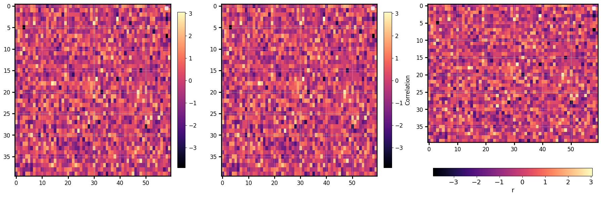

# ColorbarSpec

Describes the colorbar attached to `plot_image` and `plot_hexbin`. You rarely build one by
hand thanks to the `colorbar=` argument.

`colorbar=` accepts `True` (default bar), a `str` (its label), or a `ColorbarSpec`.

```python
import numpy as np
import behaviz as bv
import matplotlib.pyplot as plt

fig,axs = plt.subplots(1,3,figsize=(18,6,)) # for matplotlib and seaborn backends

data = np.random.default_rng(0).normal(size=(40, 60))
fig, ax = bv.plot_image(data, cmap="magma")

bv.plot_image(matrix, ax=ax[0], cmap="magma", colorbar=True)        # default bar
bv.plot_image(matrix, ax=ax[1], cmap="magma", colorbar="Correlation")  # str → labelled bar
bv.plot_image(matrix, ax=ax[2], cmap="magma",
              colorbar=bv.ColorbarSpec(label="r", location="bottom", fontsize=14))  # full control
```



## Fields

| Field | Default | Meaning |
| --- | --- | --- |
| `label` | `""` | colorbar label |
| `location` | `"right"` | `right` / `left` / `top` / `bottom` |
| `ticks` | `None` | explicit tick positions |
| `tick_fmt` | `None` | printf format, e.g. `"%.1f"` |
| `fraction` | `0.046` | bar size as a fraction of the axes (matches axes height by default) |
| `pad` | `None` | gap between axes and bar (`None` → sensible default) |
| `fontsize` | `12` | label + tick-label font size |

!!! note "matplotlib / seaborn"
    Colorbars are a matplotlib construct; behaviz renders them on the matplotlib and
    seaborn backends. The bokeh backend draws the image itself but does not yet attach a
    behaviz colorbar.
