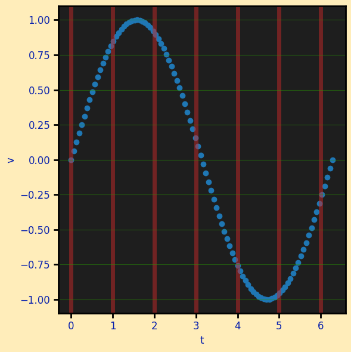

# FigureSpec

`spec.figure` is a `FigureSpec` — figure-level properties (size, resolution, backgrounds,
font). Used when the spec creates its own figure.

```python
import behaviz as bv

spec = bv.PlotSpec(
    figure=bv.FigureSpec(figsize=(8, 5), dpi=150, face_color="#101010", axes_color="#181818"),
    text_color="#e0e0e0",
)
bv.plot_line("t", "v", data=df, spec=spec)
```

## Fields

| Field | Default | Meaning |
| --- | --- | --- |
| `figsize` | `(12, 8)` | figure size, inches |
| `dpi` | `120` | dots per inch |
| `tight` | `True` | call `tight_layout()` automatically |
| `style` | `"default"` | a `plt.style` name, a preset, or a raw rcParams dict |
| `face_color` | `None` | figure background (`None` → backend default) |
| `axes_color` | `None` | plot-area background |
| `font_family` | `None` | font family for all text |

## Examples

### Size & resolution

```python
bv.FigureSpec(figsize=(6, 4), dpi=300)   # print-ready
```

### Dark backgrounds, without a preset

`face_color`/`axes_color` are first-class fields and they work on **bokeh** too. Pair with `PlotSpec.text_color` so labels stay legible.

```python
import behaviz as bv
import numpy as np
import polars as pl

x = np.linspace(0, 2 * np.pi, 100)
y = np.sin(x)

df = pl.DataFrame({"t":x,"v":y})

spec = bv.PlotSpec(
    figure=bv.FigureSpec(face_color="#ffebb1e0",
    axes_color="#1e1e1e"),
    text_color="#061fad",
    x=bv.AxisSpec(grid_color="#c42828"),
    y=bv.AxisSpec(grid_color="#299803"),
)

bv.plot_scatter("t","v",data=df, spec=spec)
```



### Raw rcParams via `style`

For matplotlib/seaborn you can still drop a full rcParams dict on `style` (line widths,
marker sizes, fonts). bokeh has no rcParams, so it honours **background and text colour
only** from a style — which is why the discrete fields above exist.

```python
bv.FigureSpec(style={"lines.linewidth": 3, "axes.facecolor": "#fafafa"})
```

!!! tip "Presets set these for you"
    The built-in presets (`presentation`, `presentation_dark`, `print`, …) populate
    `face_color`/`axes_color`/`font_family`/spine/tick fields from their rcParams, so a
    preset renders the same on all three backends. See [Presets](../presets.md).
